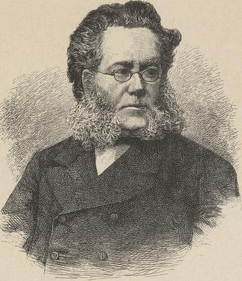

# Inspirasjonsideer til utforsking av bildesøkappen

 * Finn bøker som beskriver et spesifikt kunstverk. For eksempel, prøv å finn bøker med en avbildning av [Afrodite fra Milo](https://no.wikipedia.org/wiki/Venus_fra_Milo). (Du kan laste ned et bilde du kan søke med her [her](https://upload.wikimedia.org/wikipedia/commons/thumb/a/af/V%C3%A9nus_de_Milo_-_Mus%C3%A9e_du_Louvre_AGER_LL_299_%3B_N_527_%3B_Ma_399.jpg/426px-V%C3%A9nus_de_Milo_-_Mus%C3%A9e_du_Louvre_AGER_LL_299_%3B_N_527_%3B_Ma_399.jpg?download))
 * Lag en tegning i paint (f.eks. av en blomst, et dyr eller et redskap) og bruk det til å søke basert på bilde.
 * Utforsk Theodor Kittelsens tegninger ved å bruke søkeinstillingene til å filtrere søket slik at det kun inneholde bilder med medvirkende forfatter "Kittelsen" (du kan også prøve å snevre søket til bilder i nærheten av ordet "Askeladden")
 * Finn første bok som bruker dette tresnittet av Henrik Ibsen (last ned [her](https://raw.githubusercontent.com/Sprakbanken/dhlab_seminar/refs/heads/main/bildesøk/bilder/ibsen.jpg)):

 * Utforsk hvordan en bygning har blitt presentert i bøker over tid. For eksempel kan du ta utgangspunkt i hvordan bilder av Nidarosdomen har forandret seg.